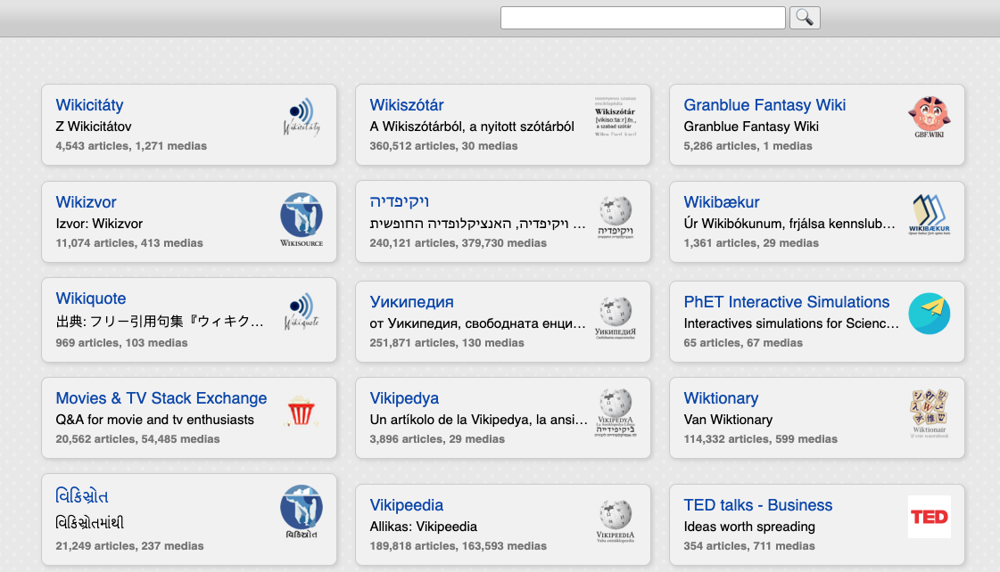

<!--
NOTA: Este README foi creado automáticamente por <https://github.com/YunoHost/apps/tree/master/tools/readme_generator>
NON debe editarse manualmente.
-->

# Kiwix para YunoHost

[](https://ci-apps.yunohost.org/ci/apps/kiwix/)  

[](https://install-app.yunohost.org/?app=kiwix)

*[Le este README en outros idiomas.](./ALL_README.md)*

> *Este paquete permíteche instalar Kiwix de xeito rápido e doado nun servidor YunoHost.*  
> *Se non usas YunoHost, le a [documentación](https://yunohost.org/install) para saber como instalalo.*

## Vista xeral

Kiwix is an offline reader for online content like Wikipedia, Project Gutenberg, or TED Talks. It makes knowledge available to people with no or limited internet access. The software as well as the content is free to use for anyone.

### Features

- Full text search engine
- Search suggestions
- Compatible with almost all browsers
- Available as command line executable
- Embedded in Kiwix UI
- Able to deal with one ZIM file or XML library files


**Versión proporcionada:** 3.6.0~ynh2

**Demo:** <http://library.kiwix.org/>

## Capturas de pantalla



## Documentación e recursos

- Web oficial da app: <https://www.kiwix.org/>
- Documentación oficial para admin: <https://wiki.kiwix.org/wiki/Kiwix-serve/>
- Repositorio de orixe do código: <https://github.com/kiwix/kiwix-tools>
- Tenda YunoHost: <https://apps.yunohost.org/app/kiwix>
- Informar dun problema: <https://github.com/YunoHost-Apps/kiwix_ynh/issues>

## Info de desenvolvemento

Envía a túa colaboración á [rama `testing`](https://github.com/YunoHost-Apps/kiwix_ynh/tree/testing).

Para probar a rama `testing`, procede deste xeito:

```bash
sudo yunohost app install https://github.com/YunoHost-Apps/kiwix_ynh/tree/testing --debug
ou
sudo yunohost app upgrade kiwix -u https://github.com/YunoHost-Apps/kiwix_ynh/tree/testing --debug
```

**Máis info sobre o empaquetado da app:** <https://yunohost.org/packaging_apps>
